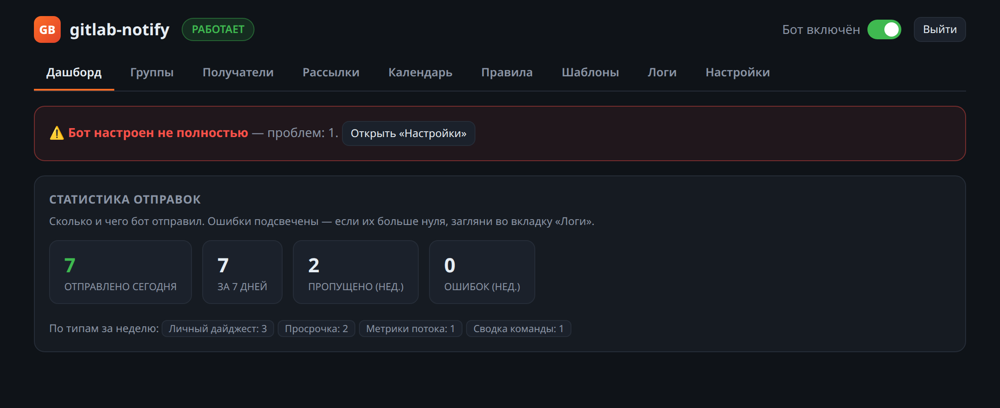
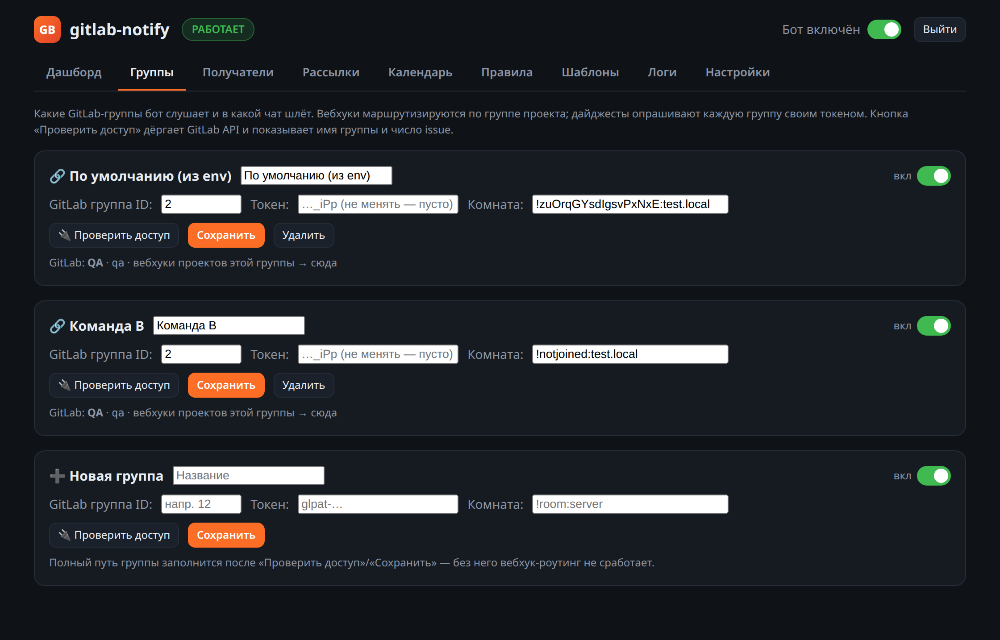
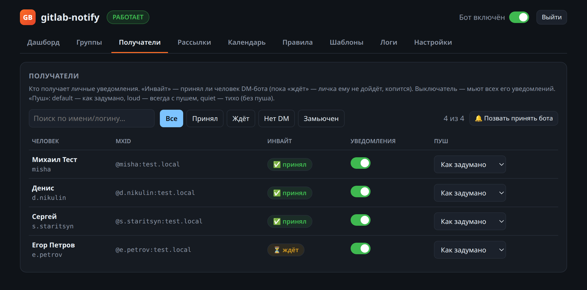
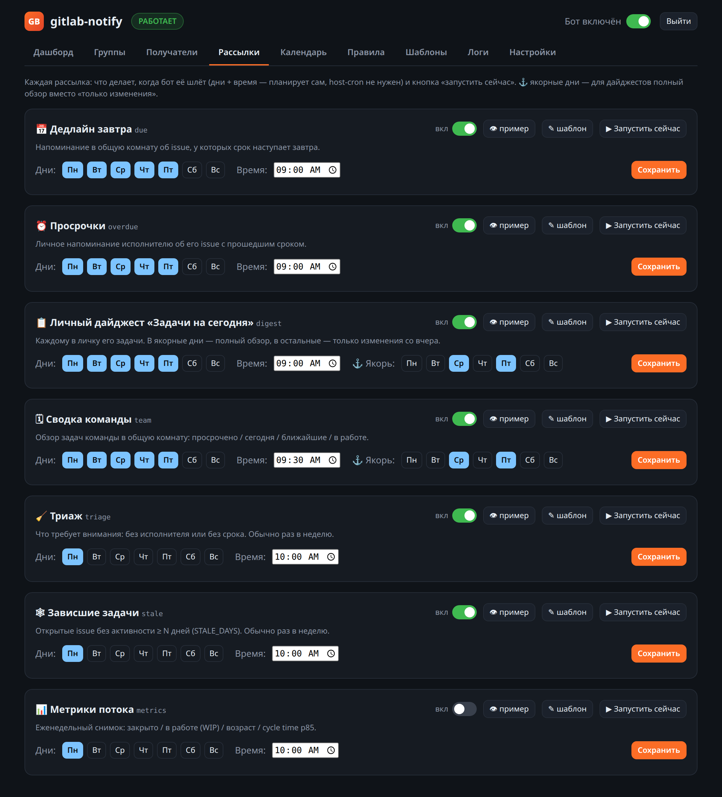
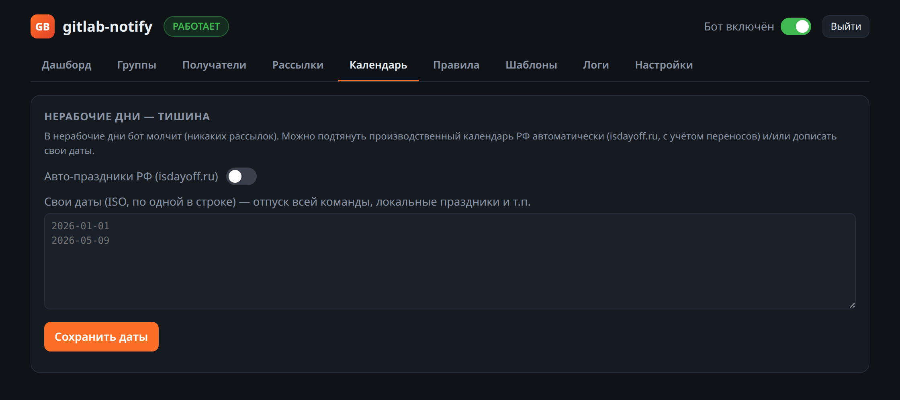
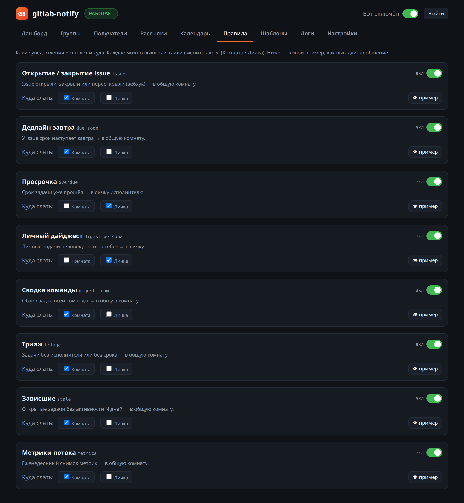
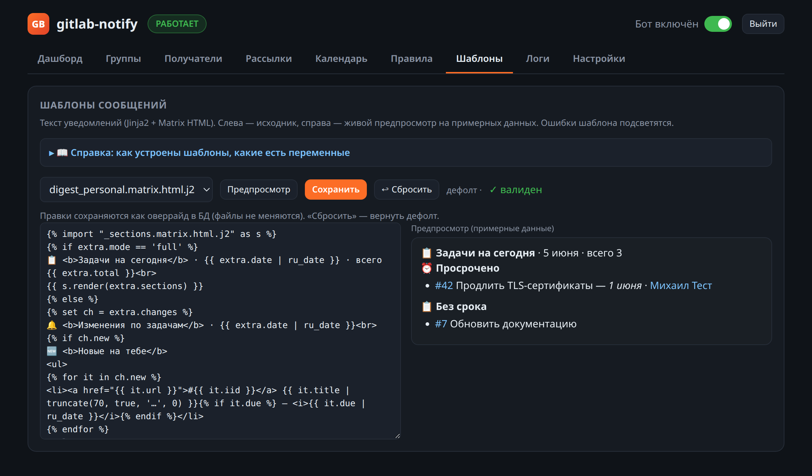
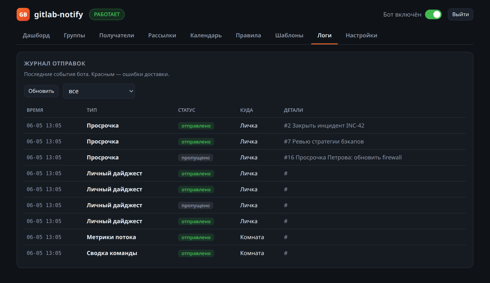
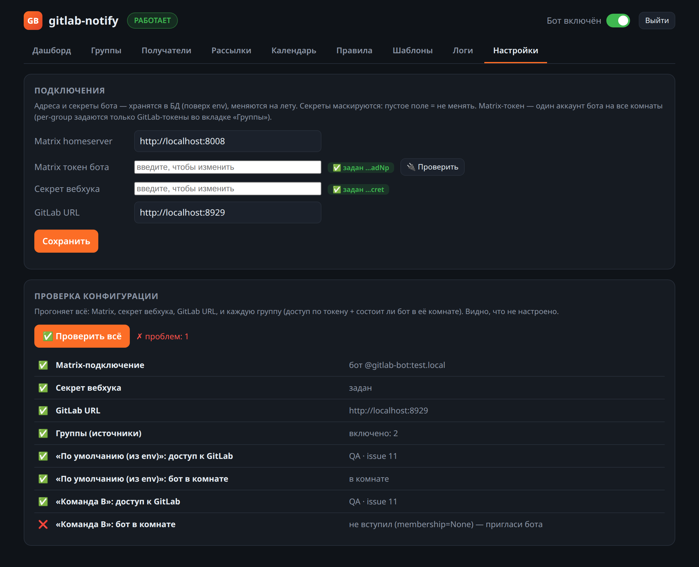

# Веб-админка gitlab-notify

Панель управления ботом на `/admin` (пароль — env `ADMIN_PASSWORD`, единственный
секрет в env). Всё остальное — подключения, группы, расписания, правила, шаблоны,
мьюты — настраивается **здесь**, без правки файлов на сервере. Состояние лежит в
`/data/state.db`.

Доступ: `http://<host>:8081/admin`. Порт за паролем — для прода держи его не в
публичной сети (SSH-туннель `ssh -L 8081:127.0.0.1:8081 …` или reverse-proxy с
HTTPS). При первом запуске бот стартует **ненастроенным** — заходишь и
настраиваешь.

---

## Дашборд
Сверху — баннер «бот настроен / настроен не полностью» (с кнопкой в «Настройки»).
Ниже — статистика отправок (сегодня / за 7 дней / пропущено / ошибки) и разбивка
по типам уведомлений.

## Группы
Мультигруппа: каждый **источник** = GitLab-группа → Matrix-комната + свой токен.
Вебхуки маршрутизируются по группе проекта в нужную комнату; дайджесты опрашивают
каждую группу её токеном. Кнопка **«Проверить доступ»** дёргает GitLab API и
показывает имя группы и число issue. Токены маскируются.

## Получатели
Кто получает личные уведомления, статус DM-инвайта (принял / ждёт / нет DM),
мьют на человека, пуш-режим (как задумано / всегда пуш / тихо). Поиск, готовые
фильтры, кнопка «Позвать принять бота» (тегает непринявших в общем чате).

## Рассылки
Каждая рассылка — карточка: что делает, дни недели + время (бот планирует сам,
host-cron не нужен), ⚓ якорные дни (полный обзор vs только изменения), кнопки
**«👁 пример»**, **«✎ шаблон»** и **«▶ Запустить сейчас»** с показом результата.

## Календарь
Нерабочие дни (тишина): авто-праздники РФ через isdayoff.ru и/или свои даты.

## Правила
Какие уведомления бот шлёт и куда (Комната / Личка), с человеческими названиями,
описанием и **живым примером** сообщения. Каждое можно выключить или сменить
адрес.

## Шаблоны
Текст уведомлений (Jinja2 + Matrix HTML): слева исходник, справа живой
предпросмотр + валидатор. Правки сохраняются **оверрайдом в БД** (файлы не
меняются); «Сбросить» возвращает дефолт. Есть справка по переменным и хелперам.

## Логи
Журнал всех отправок со статус-бейджами (отправлено / пропущено / ошибка),
фильтром и подсветкой ошибок красным.

## Настройки
Подключения бота — Matrix homeserver/токен (кнопка «Проверить» = whoami), секрет
вебхука, GitLab URL. Хранятся в БД, секреты маскируются с бейджем «✅ задан …xxxx».
Кнопка **«Проверить всё»** прогоняет конфигурацию: Matrix, вебхук, GitLab и каждую
группу (доступ по токену + состоит ли бот в её комнате) — видно, что не так
(на скрине ❌ «Команда B: бот в комнате» — указана несуществующая комната).

